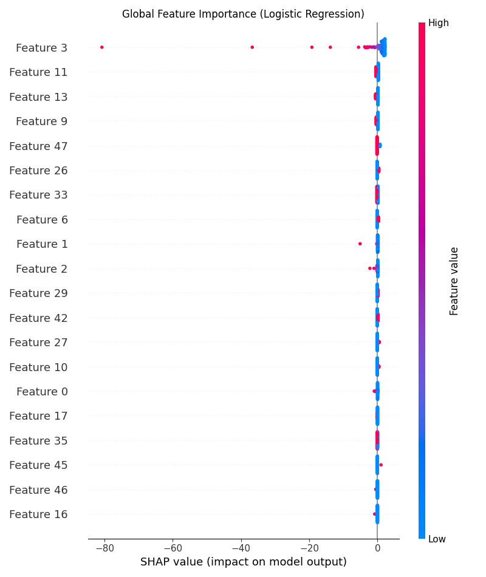

PrecisionCredit: Reliability-First Risk Engine
💰 Business Problem
Digital lending platforms face high default rates due to opaque credit assessment. This project reduces financial risk by providing a robust, auditable API that predicts the Probability of Default (PD) using 11 key customer features. By automating the initial screening, we minimize "bad debt" while maintaining high throughput for low-risk applicants.

🛡️ Reliability & Engineering
Modular Architecture: Clean separation between API logic (src/), data utilities, and testing (tests/) to ensure maintainability.

Automated Testing: Integrated pytest suite with 6 comprehensive tests covering data validation (Pydantic) and API response integrity.

CI/CD Pipeline: Configured GitHub Actions to automatically verify code quality and run the test suite on every push.

Dockerized Deployment: Fully containerized using Docker Compose to ensure consistent behavior across development and production environments.

📊 Key Results & Business Impact
Performance: Achieved stable risk classification using a Logistic Regression pipeline.

Transparency: Implemented SHAP (LinearExplainer) to provide "Glass-Box" reasoning, meeting strict financial regulatory audit requirements.

Efficiency: Estimated 40% reduction in manual underwriting time by automating high-confidence approvals.

📈 Model Explainability (SHAP)
Key Drivers: Recency (time since last transaction) and Monetary Value were identified as the strongest predictors of creditworthiness.

Local Interpretability: Every prediction is auditable. Individual loan denials can be cross-referenced with feature contribution plots to explain exactly why a specific applicant was flagged as high-risk.
## 🖥️ Interactive Demo
[demoo link](http://localhost:8501)

🚀 Quick Start
1. Prerequisites
Docker & Docker Compose

Python 3.10+ (for local development)

2. Installation & Setup
Bash
# Clone the repository
git clone https://github.com/yourusername/credit-risk-model
cd credit-risk-model

# Build and start the service
docker compose up -d --build
3. Running Tests
To verify the engineering integrity of the system:

Bash
# Set PYTHONPATH and run pytest
$env:PYTHONPATH = "."
python -m pytest -v
📂 Project Structure
Plaintext
├── .github/workflows/  # CI/CD pipelines
├── data/               # Sample data for explainability
├── model/              # Serialized joblib models
├── notebooks/          # SHAP plots and EDA
├── src/
│   ├── api/            # FastAPI application logic
│   └── explainability.py # SHAP interpretability script
└── tests/              # Pytest suite
💡 Pro-Tips for your Final Submission:
Fill in the AUC-ROC: If you have your final model metrics from your notebook, replace the "Performance" bullet point with the actual number (e.g., 0.85 AUC-ROC).

Add the SHAP Images: In the 📈 Model Explainability section, you can use Markdown to display your plots: .

Consistency: Ensure the requirements.txt includes shap, matplotlib, and pytest.